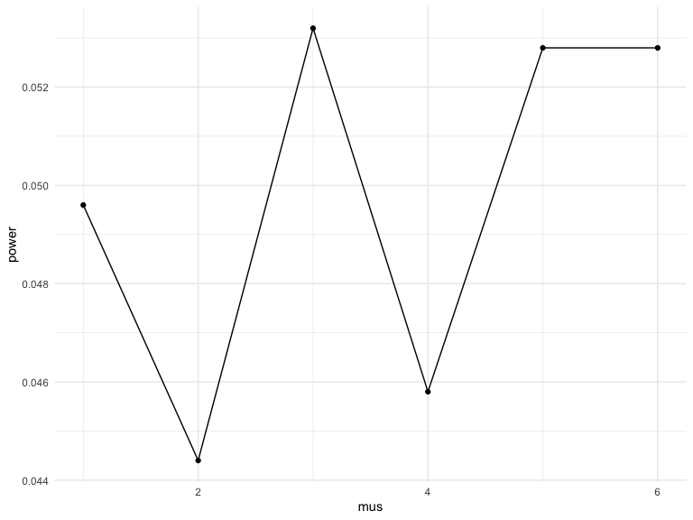

p8105_hw5_khs2318
================
Kayla Schiffer-Kane
2023-11-15

- [Problem 1](#problem-1)
  - [Load Data](#load-data)
  - [Proportion of Unsolved
    Homicides](#proportion-of-unsolved-homicides)
    - [Baltimore](#baltimore)
    - [All Cities](#all-cities)
  - [Plot CIs by city](#plot-cis-by-city)
- [Problem 2](#problem-2)
  - [Load and Tidy Data](#load-and-tidy-data)
  - [Plot](#plot)
- [Problem 3](#problem-3)
  - [Plot Power](#plot-power)
  - [Plot Estimate and True $\mu$](#plot-estimate-and-true-mu)

# Problem 1

The Washington Post has gathered data on homicides in 50 large U.S.
cities and made the data available through a GitHub repository here. You
can read their accompanying article here.

## Load Data

**Describe the raw data. Create a city_state variable (e.g. “Baltimore,
MD”) and then summarize within cities to obtain the total number of
homicides and the number of unsolved homicides (those for which the
disposition is “Closed without arrest” or “Open/No arrest”).**

``` r
data = read_csv('./data/homicide-data.csv') |>
  janitor::clean_names() |>
  mutate(city_state = paste(city,state, sep = ", "))
```

The data has 52179 rows and 13 columns. The data includes character
variables with details on the victims, including their names, race, age,
and sex. It also includes variables for the city and state where the
murder happened. There are 50 cities and 28 states. The data also
includes disposition, which describes the status of the case, and
details on reporting including date, latitude, and longitude.

``` r
data_prop = data |> 
  group_by(city, city_state) |>
  summarize(n_cases = n(), 
            n_unsolved = 
              sum(disposition %in% c("Closed without arrest","Open/No arrest")))
data_prop |>
  knitr::kable()
```

| city           | city_state         | n_cases | n_unsolved |
|:---------------|:-------------------|--------:|-----------:|
| Albuquerque    | Albuquerque, NM    |     378 |        146 |
| Atlanta        | Atlanta, GA        |     973 |        373 |
| Baltimore      | Baltimore, MD      |    2827 |       1825 |
| Baton Rouge    | Baton Rouge, LA    |     424 |        196 |
| Birmingham     | Birmingham, AL     |     800 |        347 |
| Boston         | Boston, MA         |     614 |        310 |
| Buffalo        | Buffalo, NY        |     521 |        319 |
| Charlotte      | Charlotte, NC      |     687 |        206 |
| Chicago        | Chicago, IL        |    5535 |       4073 |
| Cincinnati     | Cincinnati, OH     |     694 |        309 |
| Columbus       | Columbus, OH       |    1084 |        575 |
| Dallas         | Dallas, TX         |    1567 |        754 |
| Denver         | Denver, CO         |     312 |        169 |
| Detroit        | Detroit, MI        |    2519 |       1482 |
| Durham         | Durham, NC         |     276 |        101 |
| Fort Worth     | Fort Worth, TX     |     549 |        255 |
| Fresno         | Fresno, CA         |     487 |        169 |
| Houston        | Houston, TX        |    2942 |       1493 |
| Indianapolis   | Indianapolis, IN   |    1322 |        594 |
| Jacksonville   | Jacksonville, FL   |    1168 |        597 |
| Kansas City    | Kansas City, MO    |    1190 |        486 |
| Las Vegas      | Las Vegas, NV      |    1381 |        572 |
| Long Beach     | Long Beach, CA     |     378 |        156 |
| Los Angeles    | Los Angeles, CA    |    2257 |       1106 |
| Louisville     | Louisville, KY     |     576 |        261 |
| Memphis        | Memphis, TN        |    1514 |        483 |
| Miami          | Miami, FL          |     744 |        450 |
| Milwaukee      | Milwaukee, wI      |    1115 |        403 |
| Minneapolis    | Minneapolis, MN    |     366 |        187 |
| Nashville      | Nashville, TN      |     767 |        278 |
| New Orleans    | New Orleans, LA    |    1434 |        930 |
| New York       | New York, NY       |     627 |        243 |
| Oakland        | Oakland, CA        |     947 |        508 |
| Oklahoma City  | Oklahoma City, OK  |     672 |        326 |
| Omaha          | Omaha, NE          |     409 |        169 |
| Philadelphia   | Philadelphia, PA   |    3037 |       1360 |
| Phoenix        | Phoenix, AZ        |     914 |        504 |
| Pittsburgh     | Pittsburgh, PA     |     631 |        337 |
| Richmond       | Richmond, VA       |     429 |        113 |
| Sacramento     | Sacramento, CA     |     376 |        139 |
| San Antonio    | San Antonio, TX    |     833 |        357 |
| San Bernardino | San Bernardino, CA |     275 |        170 |
| San Diego      | San Diego, CA      |     461 |        175 |
| San Francisco  | San Francisco, CA  |     663 |        336 |
| Savannah       | Savannah, GA       |     246 |        115 |
| St. Louis      | St. Louis, MO      |    1677 |        905 |
| Stockton       | Stockton, CA       |     444 |        266 |
| Tampa          | Tampa, FL          |     208 |         95 |
| Tulsa          | Tulsa, AL          |       1 |          0 |
| Tulsa          | Tulsa, OK          |     583 |        193 |
| Washington     | Washington, DC     |    1345 |        589 |

## Proportion of Unsolved Homicides

### Baltimore

**For the city of Baltimore, MD, use the prop.test function to estimate
the proportion of homicides that are unsolved; save the output of
`prop.test` as an R object, apply the `broom::tidy` to this object and
pull the estimated proportion and confidence intervals from the
resulting tidy dataframe.**

``` r
data_prop |>
  filter(city_state == "Baltimore, MD") |>
  mutate(prop = map2(n_unsolved, n_cases, ~broom::tidy(prop.test(.x,.y)))) |>
  unnest(prop) |>
  select(estimate,conf.low,conf.high)
```

    ## # A tibble: 1 × 4
    ## # Groups:   city [1]
    ##   city      estimate conf.low conf.high
    ##   <chr>        <dbl>    <dbl>     <dbl>
    ## 1 Baltimore    0.646    0.628     0.663

### All Cities

**Now run prop.test for each of the cities in your dataset, and extract
both the proportion of unsolved homicides and the confidence interval
for each. Do this within a “tidy” pipeline, making use of `purrr::map`,
`purrr::map2`, list columns and unnest as necessary to create a tidy
dataframe with estimated proportions and CIs for each city.**

``` r
city_prop = data_prop |>
  mutate(prop = map2(n_unsolved, n_cases, ~broom::tidy(prop.test(.x,.y)))) |>
  unnest(prop) |>
  select(city, city_state, n_cases, n_unsolved, estimate,conf.low,conf.high)
city_prop
```

    ## # A tibble: 51 × 7
    ## # Groups:   city [50]
    ##    city        city_state      n_cases n_unsolved estimate conf.low conf.high
    ##    <chr>       <chr>             <int>      <int>    <dbl>    <dbl>     <dbl>
    ##  1 Albuquerque Albuquerque, NM     378        146    0.386    0.337     0.438
    ##  2 Atlanta     Atlanta, GA         973        373    0.383    0.353     0.415
    ##  3 Baltimore   Baltimore, MD      2827       1825    0.646    0.628     0.663
    ##  4 Baton Rouge Baton Rouge, LA     424        196    0.462    0.414     0.511
    ##  5 Birmingham  Birmingham, AL      800        347    0.434    0.399     0.469
    ##  6 Boston      Boston, MA          614        310    0.505    0.465     0.545
    ##  7 Buffalo     Buffalo, NY         521        319    0.612    0.569     0.654
    ##  8 Charlotte   Charlotte, NC       687        206    0.300    0.266     0.336
    ##  9 Chicago     Chicago, IL        5535       4073    0.736    0.724     0.747
    ## 10 Cincinnati  Cincinnati, OH      694        309    0.445    0.408     0.483
    ## # ℹ 41 more rows

## Plot CIs by city

**Create a plot that shows the estimates and CIs for each city – check
out geom_errorbar for a way to add error bars based on the upper and
lower limits. Organize cities according to the proportion of unsolved
homicides.**

``` r
city_prop |>
  ggplot(aes(x = reorder(city_state, estimate), y = estimate)) + geom_point() + geom_errorbar(aes(ymin = conf.low, ymax = conf.high)) + theme(axis.text.x = element_text(angle = 60, hjust = 1))
```


# Problem 2

**This zip file contains data from a longitudinal study that included a
control arm and an experimental arm. Data for each participant is
included in a separate file, and file names include the subject ID and
arm.**

## Load and Tidy Data

**Create a tidy dataframe containing data from all participants,
including the subject ID, arm, and observations over time:**

- **Start with a dataframe containing all file names; the list.files
  function will help**

``` r
list_names = list.files("./data/", pattern = "[a-z]{3}_\\d{2}\\.csv")
study_df = data.frame(file_name = list_names)
```

- **Iterate over file names and read in data for each subject using
  purrr::map and saving the result as a new variable in the dataframe**

``` r
study_df = study_df |>
  mutate(data = map(file_name, ~read_csv(file.path("./data/",.x)))) |>
  unnest(data)
```

- **Tidy the result; manipulate file names to include control arm and
  subject ID, make sure weekly observations are “tidy”, and do any other
  tidying that’s necessary**

``` r
study_df = study_df |>
  mutate(arm = case_match(substr(file_name, 1, 3), "con" ~ "control", "exp" ~ "experimental")) |>
  mutate(subject_id = substr(file_name, 5, 6)) |>
  mutate(file_name = substr(file_name, 1, 6))

head(study_df)
```

    ## # A tibble: 6 × 11
    ##   file_name week_1 week_2 week_3 week_4 week_5 week_6 week_7 week_8 arm    
    ##   <chr>      <dbl>  <dbl>  <dbl>  <dbl>  <dbl>  <dbl>  <dbl>  <dbl> <chr>  
    ## 1 con_01      0.2   -1.31   0.66   1.96   0.23   1.09   0.05   1.94 control
    ## 2 con_02      1.13  -0.88   1.07   0.17  -0.83  -0.31   1.58   0.44 control
    ## 3 con_03      1.77   3.11   2.22   3.26   3.31   0.89   1.88   1.01 control
    ## 4 con_04      1.04   3.66   1.22   2.33   1.47   2.7    1.87   1.66 control
    ## 5 con_05      0.47  -0.58  -0.09  -1.37  -0.32  -2.17   0.45   0.48 control
    ## 6 con_06      2.37   2.5    1.59  -0.16   2.08   3.07   0.78   2.35 control
    ## # ℹ 1 more variable: subject_id <chr>

## Plot

**Make a spaghetti plot showing observations on each subject over time,
and comment on differences between groups.**

``` r
study_df |>
  pivot_longer(cols = starts_with("week"),
               names_to = "week",
               values_to = "value") |>
  mutate(week = substr(week, 6, 6)) |>
  ggplot(aes(x = week, y = value, group = file_name, color = arm)) + 
  geom_point() + 
  geom_line()
```


The control arm and experimental arm seem to start around the same
values at week 1, but the experimental increase over time and the
control stay the same. The experimental arm values seem to be noticeably
greater than than control values around weeks 3-4.

# Problem 3

**When designing an experiment or analysis, a common question is whether
it is likely that a true effect will be detected – put differently,
whether a false null hypothesis will be rejected. The probability that a
false null hypothesis is rejected is referred to as power, and it
depends on several factors, including: the sample size; the effect size;
and the error variance. In this problem, you will conduct a simulation
to explore power in a one-sample t-test.**

**First set the following design elements:**

- Fix $n=30$
- Fix $\sigma = 5$

``` r
set.seed(1)
n = 30
sigma = 5
```

Set $\mu=0$. Generate 5000 datasets from the model

$$ x \sim Normal[\mu, \sigma] $$

For each dataset, save $\hat{\mu}$ and the p-value arising from a test
of $H : \mu = 0$ using $\alpha = 0.05$. *Hint: to obtain the estimate
and p-value, use `broom::tidy` to clean the output of `t.test`.*

``` r
mu = 0 
alpha = 0.05

sim_results_df0 = 
  expand_grid(sample_size = n, iter = 1:5000) |> 
  mutate(data = map(iter, ~rnorm(n, mean = mu, sd = sigma))) |>
  mutate(mu_result = map_dbl(data, ~mean(.x))) |>
  mutate(t_test = map(data, ~broom::tidy(t.test(.x, mu = 0, conf.level = 1 - alpha)))) |>
  unnest(t_test) |> 
  select(iter, data, mu_result, p.value)

sim_results_df0
```

    ## # A tibble: 5,000 × 4
    ##     iter data       mu_result p.value
    ##    <int> <list>         <dbl>   <dbl>
    ##  1     1 <dbl [30]>     0.412  0.629 
    ##  2     2 <dbl [30]>     0.664  0.368 
    ##  3     3 <dbl [30]>     0.551  0.534 
    ##  4     4 <dbl [30]>     0.567  0.487 
    ##  5     5 <dbl [30]>    -1.65   0.0599
    ##  6     6 <dbl [30]>     1.19   0.229 
    ##  7     7 <dbl [30]>     0.334  0.738 
    ##  8     8 <dbl [30]>    -1.19   0.209 
    ##  9     9 <dbl [30]>     0.122  0.887 
    ## 10    10 <dbl [30]>     0.684  0.472 
    ## # ℹ 4,990 more rows

Repeat the above for $\mu = \{1, 2, 3, 4, 5, 6\}$, and complete the
following:

``` r
sim_results_df =  
  expand_grid(sample_size = n, mus = c(1, 2, 3, 4, 5, 6), iter = 1:5000) |>
  mutate(data = map(mus, ~rnorm(n, mean = .x, sd = sigma))) |>
  mutate(mu_result = map_dbl(data, ~mean(.x))) |>
  mutate(t_test = map2(data, mus, ~broom::tidy(t.test(.x, mu = .y, conf.level = 1 - alpha)))) |>
  unnest(t_test) |>
  select(iter, mus, data, mu_result, p.value)

sim_results_df
```

    ## # A tibble: 30,000 × 5
    ##     iter   mus data       mu_result p.value
    ##    <int> <dbl> <list>         <dbl>   <dbl>
    ##  1     1     1 <dbl [30]>     1.52    0.549
    ##  2     2     1 <dbl [30]>     2.11    0.188
    ##  3     3     1 <dbl [30]>     2.01    0.220
    ##  4     4     1 <dbl [30]>     0.165   0.309
    ##  5     5     1 <dbl [30]>     0.108   0.365
    ##  6     6     1 <dbl [30]>     1.56    0.503
    ##  7     7     1 <dbl [30]>     2.04    0.238
    ##  8     8     1 <dbl [30]>     2.40    0.144
    ##  9     9     1 <dbl [30]>     2.15    0.180
    ## 10    10     1 <dbl [30]>     0.500   0.634
    ## # ℹ 29,990 more rows

## Plot Power

- Make a plot showing the proportion of times the null was rejected (the
  power of the test) on the y axis and the true value of $\mu$ on the x
  axis. Describe the association between effect size and power.

``` r
sim_results_df |>
  group_by(mus) |>
  mutate(power = sum(p.value < alpha) / n()) |>
  select(mus, power) |>
  unique() |>
  ggplot(aes(x = mus, y = power)) + geom_line() + geom_point()
```



We’d expect effect size and power to increase together, which they seem
to to an extent (power is greater for mu = 5,6 than 1,2) but there is
variability and no clear pattern. This can be a result of sample size /
alpha.

## Plot Estimate and True $\mu$

- Make a plot showing the average estimate of $\hat{\mu}$ on the y axis
  and the true value of $\mu$ on the x axis.

``` r
sim_results_df |> 
  group_by(mus) |>
  summarize(mean_mu = mean(mu_result)) |>
  ggplot(aes(x = mus, y = mean_mu)) + geom_point() + geom_line()
```


- Make a second plot (or overlay on the first) the average estimate of
  $\hat{\mu}$ **only in samples for which the null was rejected** on the
  y axis and the true value of $\mu$ on the x axis.

``` r
sim_results_df |> 
  filter(p.value < alpha) |>
  group_by(mus) |>
  summarize(mean_mu = mean(mu_result)) |>
  ggplot(aes(x = mus, y = mean_mu)) + geom_point() + geom_line()
```


**Is the sample average of $\hat{\mu}$ across tests for which the null
is rejected approximately equal to the true value of $\mu$? Why or why
not?** Yes - because when the null hypothesis is true, we’d expect the
average of simulated data for rejected tests to be equal to the true
value of $\mu$, subject to variability due to sample size/power.
